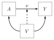
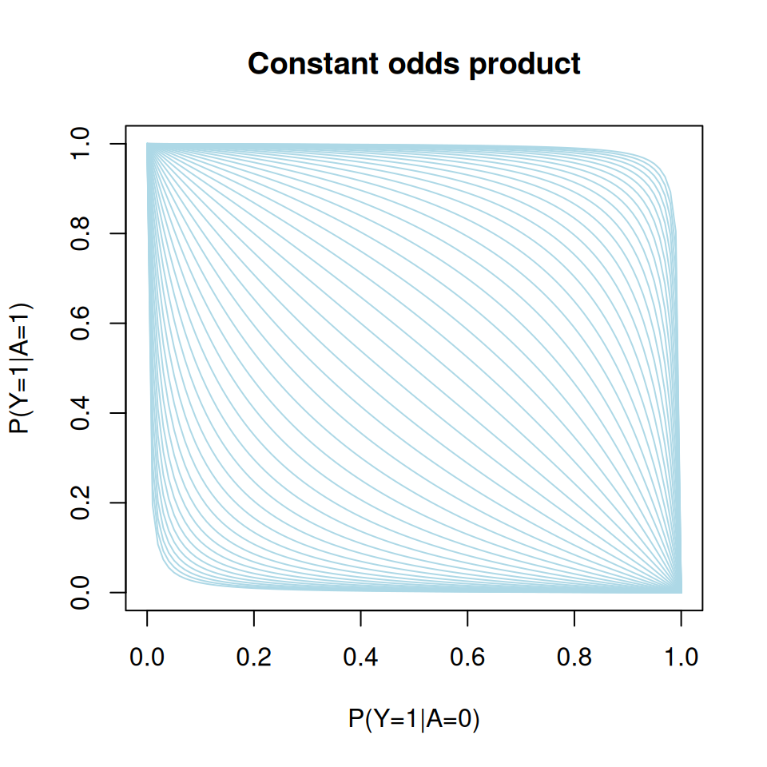
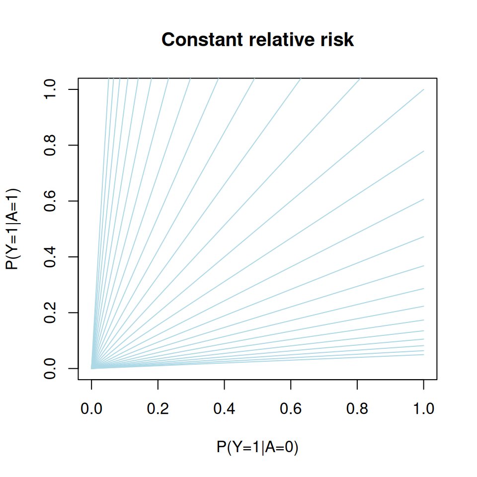

# Estimating a relative risk or risk difference with a binary exposure

## Introduction

Let Y be a *binary response*, A a *binary exposure*, and V a *vector of
covariates*.



DAG for the statistical model with the dashed edge representing a
potential interaction between exposure A and covariates V.

In a common setting, the main interest lies in quantifying the treatment
effect, \nu, of A on Y adjusting for the set of covariates, and often a
standard approach is to use a Generalized Linear Model (GLM):

g\\ E(Y\mid A,V) \\ = A\nu^tW + \underset{\mathrm{nuisance}}{\mu^tZ}

with link function g, and W = w(V), Z= v(V) known vector functions of V.

The canonical link (logit) leads to nice computational properties
(logistic regression) and parameters with an odds-ratio interpretation.
But ORs are not *collapsible* even under randomization. For example

E(Y\mid X) = E\[ E(Y\mid X,Z) \mid X \] = E\[\operatorname{expit}( \mu +
\alpha X + \beta Z ) \mid X\] \neq \operatorname{expit}\[\mu + \alpha
X + \beta E(Z\mid X)\],

When marginalizing we leave the class of logistic regression. This
non-collapsibility makes it hard to interpret odds-ratios and to compare
results from *different studies*

**Relative risks** (and risk differences) are collapsible and generally
considered easier to interpret than odds-ratios. [Richardson et
al](https://doi.org/10.1080/01621459.2016.1192546) (JASA, 2017) proposed
a regression model for a binary exposures which solves the computational
problems and need for parameter contraints that are associated with
using for example binomial regression with a log-link function (or
identify link for the risk difference) to obtain such parameter
estimates. In the following we consider the relative risk as the
**target parameter**

\mathrm{RR}(v) = \frac{P(Y=1\mid A=1, V=v)}{P(Y=1\mid A=0, V=v)}.

Let p_a(V) = P(Y \mid A=a, V), a\in\\0,1\\, the idea is then to posit a
linear model for \theta(v) = \log \big(RR(v)\big) , i.e., \log
\big(RR(v)\big) = \alpha^Tv,

and a **nuisance model** for the *odds-product* \phi(v) =
\log\left(\frac{p\_{0}(v)p\_{1}(v)}{(1-p\_{0}(v))(1-p\_{1}(v))}\right)

noting that these two parameters are *variation independent* as
illustrated by the below L’Abbé plot.

``` r

  p0 <- seq(0,1,length.out=100)
  p1 <- function(p0,op) 1/(1+(op*(1-p0)/p0)^-1)
  plot(0, type="n", xlim=c(0,1), ylim=c(0,1),
     xlab="P(Y=1|A=0)", ylab="P(Y=1|A=1)", main="Constant odds product")
  for (op in exp(seq(-6,6,by=.25))) lines(p0,p1(p0,op), col="lightblue")
```



``` r

  p0 <- seq(0,1,length.out=100)
  p1 <- function(p0,rr) rr*p0
  plot(0, type="n", xlim=c(0,1), ylim=c(0,1),
     xlab="P(Y=1|A=0)", ylab="P(Y=1|A=1)", main="Constant relative risk")
  for (rr in exp(seq(-3,3,by=.25))) lines(p0,p1(p0,rr), col="lightblue")
```



Similarly, a model can be constructed for the risk-difference on the
following scale

\theta(v) = \operatorname{arctanh} \big(RD(v)\big).

## Simulation

First the `targeted` package is loaded

``` r

library(targeted)
```

This automatically imports [lava](https://arxiv.org/abs/1206.3421)
[(CRAN)](https://CRAN.R-project.org/package=lava) which we can use to
simulate from the Relative-Risk Odds-Product (RR-OP) model.

``` r

m <- lava::lvm(a ~ x,
         lp.target ~ 1,
         lp.nuisance ~ x+z)
m <- lava::binomial.rr(m, response="y", exposure="a", target.model="lp.target", nuisance.model="lp.nuisance")
```

The `lvm` call first defines the linear predictor for the exposure to be
of the form

\mathrm{LP}\_A := \mu_A + \alpha X

and the linear predictors for the /target parameter/ (relative risk) and
the /nuisance parameter/ (odds product) to be of the form

\mathrm{LP}\_{RR} := \mu\_{RR},

\mathrm{LP}\_{OP} := \mu\_{OP} + \beta_x X + \beta_z Z.

The covariates are by default assumed to be independent and standard
normal X, Z\sim\mathcal{N}(0,1), but their distribution can easily be
altered using the
[`lava::distribution`](https://kkholst.github.io/lava/reference/sim.lvm.html)
method.

The `binomial.rr` function

``` r

args(lava::binomial.rr)
```

    function (x, response, exposure, target.model, nuisance.model,
        exposure.model = binomial.lvm(), ...)
    NULL

then defines the link functions, i.e.,

\operatorname{logit}(E\[A\mid X,Z\]) = \mu_A + \alpha X,

\operatorname{log}(E\[Y\mid X,Z, A=1\]/E\[Y\mid X, A=0\]) = \mu\_{RR},

\operatorname{log}\\p_1(X,Z)p_0(X,Z)/\[(1-p_1(X,Z))(1-p_0(X,Z))\]\\ =
\mu\_{OP}+\beta_x X + \beta_z Z

with p_a(X,Z)=E(Y\mid A=a,X,Z).

The risk-difference model with the RD parameter modeled on the
\operatorname{arctanh} scale can be defined similarly using the
`binomial.rd` method

``` r

args(lava::binomial.rd)
```

    function (x, response, exposure, target.model, nuisance.model,
        exposure.model = binomial.lvm(), ...)
    NULL

We can inspect the parameter names of the modeled

``` r

coef(m)
```

                 m1              m2              m3              p1              p2
                "a"     "lp.target"   "lp.nuisance"           "a~x" "lp.nuisance~x"
                 p3              p4
    "lp.nuisance~z"          "a~~a" 

Here the intercepts of the model are simply given the same name as the
variables, such that \mu_A becomes `a`, and the other regression
coefficients are labeled using the “~”-formula notation, e.g., \alpha
becomes `a~x`.

Intercepts are by default set to zero and regression parameters set to
one in the simulation. Hence to simulate from the model with (mu_A,
\mu\_{RR}, \mu\_{OP}, \alpha, \beta_x, \beta_z)^T = (-1,1,-2,2,1,1)^T,
we define the parameter vector `p` given by

``` r

p <- c('a'=-1, 'lp.target'=1, 'lp.nuisance'=-1, 'a~x'=2)
```

and then simulate from the model using the `sim` method

``` r

d <- lava::sim(m, 1e4, p=p, seed=1)

head(d)
```

      a          x lp.target lp.nuisance          z y
    1 0 -0.6264538         1  -2.4307854 -0.8043316 0
    2 0  0.1836433         1  -1.8728823 -1.0565257 0
    3 0 -0.8356286         1  -2.8710244 -1.0353958 0
    4 1  1.5952808         1  -0.5902796 -1.1855604 1
    5 0  0.3295078         1  -1.1709317 -0.5004395 1
    6 0 -0.8204684         1  -2.3454571 -0.5249887 0

Notice, that in this simulated data the **target parameter** \mu\_{RR}
has been set to `lp.target =` 1.

## Estimation

### MLE

We start by fitting the model using the maximum likelihood estimator.

``` r

args(riskreg_mle)
```

    function (y, a, x1, x2 = x1, weights = rep(1, length(y)), std.err = TRUE,
        type = "rr", start = NULL, control = list(), ...)
    NULL

The `riskreg_mle` function takes vectors/matrices as input arguments
with the response `y`, exposure `a`, target parameter design matrix `x1`
(i.e., the matrix W at the start of this text), and the nuisance model
design matrix `x2` (odds product).

We first consider the case of a correctly specified model, hence we do
not consider any interactions with the exposure for the odds product and
simply let `x1` be a vector of ones, whereas the design matrix for the
log-odds-product depends on both X and Z

``` r

x1 <- model.matrix(~1, d)
x2 <- model.matrix(~x+z, d)

fit1 <- with(d, riskreg_mle(y, a, x1, x2, type="rr"))
fit1
```

                             Estimate Std.Err    2.5%   97.5%    P-value
    (Intercept)                0.9512 0.03319  0.8862  1.0163 1.204e-180
    odds-product:(Intercept)  -1.0610 0.05199 -1.1629 -0.9591  1.377e-92
    odds-product:x             1.0330 0.05944  0.9165  1.1495  1.230e-67
    odds-product:z             1.0421 0.05285  0.9386  1.1457  1.523e-86

The parameters are presented in the same order as the columns of `x1`and
`x2`, hence the target parameter estimate is in the first row

``` r

estimate(fit1, keep=1)
```

                Estimate Std.Err   2.5% 97.5%    P-value
    (Intercept)   0.9512 0.03336 0.8858 1.017 7.159e-179

### DRE

We next fit the model using a double robust estimator (DRE) which
introduces a model for the exposure E(A=1\mid V) (propensity model). The
double-robustness stems from the fact that the this estimator remains
consistent in the union model where either the odds-product model or the
propensity model is correctly specified. With both models correctly
specified the estimator is efficient.

``` r

with(d, riskreg_fit(y, a, target=x1, nuisance=x2, propensity=x2, type="rr"))
```

                Estimate Std.Err   2.5% 97.5%    P-value
    (Intercept)   0.9372  0.0339 0.8708 1.004 3.004e-168

The usual /formula/-syntax can be applied using the `riskreg` function.
Here we illustrate the double-robustness by using a *wrong propensity
model* but a correct nuisance paramter (odds-product) model:

``` r

  riskreg(y~a, nuisance=~x+z, propensity=~z, data=d, type="rr")
```

                Estimate Std.Err   2.5% 97.5%    P-value
    (Intercept)   0.9511 0.03333 0.8857 1.016 4.547e-179

Or vice-versa

``` r

  riskreg(y~a, nuisance=~z, propensity=~x+z, data=d, type="rr")
```

                Estimate Std.Err   2.5% 97.5%    P-value
    (Intercept)   0.9404 0.03727 0.8673 1.013 1.736e-140

whereas the MLE in this case yields a biased estimate of the relative
risk:

``` r

  fit2 <- with(d, riskreg_mle(y, a, x1=model.matrix(~1,d), x2=model.matrix(~z, d)))
  estimate(fit2, keep=1)
```

                Estimate Std.Err  2.5% 97.5% P-value
    (Intercept)    1.243 0.02778 1.189 1.298       0

### Interactions

The more general model where \log RR(V) = A \alpha^TV for a subset V of
the covariates can be estimated using the `target` argument:

``` r

fit <- riskreg(y~a, target=~x, nuisance=~x+z, data=d)
fit
```

                Estimate Std.Err     2.5%   97.5%    P-value
    (Intercept)  0.95267 0.03365  0.88673 1.01862 2.361e-176
    x           -0.01078 0.03804 -0.08534 0.06378  7.769e-01

As expected we do not see any evidence of an effect of X on the relative
risk with the 95% confidence limits clearly overlapping zero.

Note, that when the `propensity` argument is omitted as above, the same
design matrix is used for both the odds-product model and the propensity
model.

### Risk-difference

The syntax for fitting the risk-difference model is similar. To
illustrate this we simulate some new data from this model

``` r

m2 <- lava::binomial.rd(m, response="y", exposure="a", target.model="lp.target", nuisance.model="lp.nuisance")
d2 <- lava::sim(m2, 1e4, p=p)
```

And we can then fit the DRE with the syntax

``` r

riskreg(y~a, nuisance=~x+z, data=d2, type="rd")
```

                Estimate Std.Err   2.5% 97.5% P-value
    (Intercept)    1.032 0.02093 0.9909 1.073       0

### Influence-function

The DRE is a *regular and asymptotic linear* (RAL) estimator, hence
\sqrt{n}(\widehat{\alpha}\_{\mathrm{DRE}} - \alpha) =
\frac{1}{\sqrt{n}}\sum\_{i=1}^{n} \phi\_{\mathrm{eff}}(Z\_{i}) +
o\_{p}(1) where Z_i = (Y_i, A_i, V_i), i=1,\ldots,n are the i.i.d.
observations and \phi\_{\mathrm{eff}} is the *influence function*.

The influence function can be extracted using the `IC` method

``` r

head(IC(fit))
```

      (Intercept)          x
    1   0.6226459 -0.4585424
    2   1.2319960  0.7925974
    3   0.3941325 -0.5798067
    4  -0.8854890  2.9621436
    5  -6.9949142 -5.2133643
    6   0.5853933 -0.7571452

## SessionInfo

``` r

sessionInfo()
```

    R version 4.6.1 (2026-06-24)
    Platform: x86_64-pc-linux-gnu
    Running under: Ubuntu 24.04.4 LTS

    Matrix products: default
    BLAS:   /usr/lib/x86_64-linux-gnu/openblas-pthread/libblas.so.3
    LAPACK: /usr/lib/x86_64-linux-gnu/openblas-pthread/libopenblasp-r0.3.26.so;  LAPACK version 3.12.0

    locale:
     [1] LC_CTYPE=C.UTF-8       LC_NUMERIC=C           LC_TIME=C.UTF-8
     [4] LC_COLLATE=C.UTF-8     LC_MONETARY=C.UTF-8    LC_MESSAGES=C.UTF-8
     [7] LC_PAPER=C.UTF-8       LC_NAME=C              LC_ADDRESS=C
    [10] LC_TELEPHONE=C         LC_MEASUREMENT=C.UTF-8 LC_IDENTIFICATION=C

    time zone: UTC
    tzcode source: system (glibc)

    attached base packages:
    [1] stats     graphics  grDevices utils     datasets  methods   base

    other attached packages:
    [1] targeted_0.8

    loaded via a namespace (and not attached):
     [1] mets_1.3.12            cli_3.6.6              knitr_1.51
     [4] rlang_1.3.0            xfun_0.60              otel_0.2.0
     [7] jsonlite_2.0.0         future.apply_1.20.2    listenv_1.0.0
    [10] lava_1.9.2             htmltools_0.5.9        rmarkdown_2.31
    [13] grid_4.6.1             evaluate_1.0.5         fastmap_1.2.0
    [16] numDeriv_2016.8-1.1    mvtnorm_1.4-2          yaml_2.3.12
    [19] timereg_2.0.7          compiler_4.6.1         codetools_0.2-20
    [22] Rcpp_1.1.2             future_1.75.0          lattice_0.22-9
    [25] digest_0.6.39          R6_2.6.1               parallelly_1.48.0
    [28] parallel_4.6.1         splines_4.6.1          Matrix_1.7-5
    [31] RcppArmadillo_15.4.2-1 tools_4.6.1            globals_0.19.1
    [34] survival_3.8-6        
